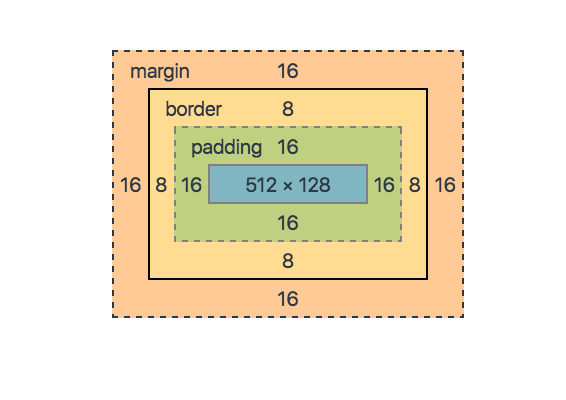

# Box

# Animaciones 
Una animación en CSS es un efecto que permite cambiar gradualmente el estilo de un elemento HTML a lo largo de un período de tiempo. Esto se logra definiendo una serie de fotogramas clave (keyframes) que describen cómo deben cambiar las propiedades CSS del elemento en diferentes puntos de la animación.

## Sintaxis Básica de Animaciones 
Para crear una animación en CSS, necesitas dos componentes principales:

+ @keyframes: Define los fotogramas clave de la animación.
+ Propiedades de animación: Aplican la animación a un elemento.

La regla @keyframes se utiliza para definir los fotogramas clave de la animación. Dentro de esta regla, especificas cómo deben cambiar las propiedades CSS en diferentes puntos de la animación.

~~~css
@keyframes nombre-de-la-animacion {
  0% {
    /* Estilos iniciales */
  }
  50% {
    /* Estilos a la mitad de la animación */
  }
  100% {
    /* Estilos finales */
  }
}
~~~

Una vez que has definido los @keyframes, puedes aplicar la animación a un elemento utilizando las siguientes propiedades:
+ animation-name: Especifica el nombre de la animación definida en @keyframes.
+ animation-duration: Define la duración de la animación en segundos (s) o milisegundos (ms).
+ animation-timing-function: Especifica la curva de velocidad de la animación (por ejemplo, linear, ease, ease-in, ease-out, ease-in-out).
+ animation-delay: Define un retraso antes de que comience la animación.
+ animation-iteration-count: Especifica cuántas veces se repetirá la animación (infinite para que se repita indefinidamente).
+ animation-direction: Define la dirección de la animación (normal, reverse, alternate, alternate-reverse).
+ animation-fill-mode: Especifica cómo se aplican los estilos antes y después de la animación (none, forwards, backwards, both).
+ animation-play-state: Permite pausar o reanudar la animación (paused, running).

## Animaciones Múltiples
Podemos aplicar múltiples animaciones a un mismo elemento separando los nombres de las animaciones con comas.

# Media Queries
Los media queries son una técnica en CSS que permite aplicar estilos condicionales basados en las características del dispositivo o entorno en el que se visualiza una página web. Son fundamentales para el diseño responsivo, ya que permiten adaptar el diseño a diferentes tamaños de pantalla, como móviles, tablets, laptops y pantallas grandes.

## Sintaxis Básica de un Media Query
~~~css
@media [tipo de medio] and (condición) {
  /* Estilos CSS que se aplican si la condición es verdadera */
}
~~~
+ @media: Es la regla que indica que estamos definiendo un media query.
+ [tipo de medio]: Especifica el tipo de dispositivo o medio al que se aplica el query (opcional).
+ (condición): Define la condición que debe cumplirse para que se apliquen los estilos.
+ { ... }: Contiene los estilos CSS que se aplicarán si la condición es verdadera.

## Tipos de Medio
Los media queries pueden aplicarse a diferentes tipos de medios. Algunos de los más comunes son:

+ all: Aplica a todos los dispositivos (valor por defecto).
+ screen: Aplica a pantallas (computadoras, tablets, móviles, etc.).
+ print: Aplica a documentos impresos o en modo de vista previa de impresión.
+ speech: Aplica a lectores de pantalla.

~~~css
@media screen and (max-width: 768px) {
  body {
    background-color: lightblue;
  }
}
~~~

## Condiciones Comunes en Media Queries
Las condiciones más utilizadas en los media queries están relacionadas con las dimensiones de la pantalla, la orientación y la resolución
### Ancho de la Pantalla (width, min-width, max-width)
+ width: Aplica estilos cuando el ancho de la pantalla es exactamente igual a un valor específico.
+ min-width: Aplica estilos cuando el ancho de la pantalla es mayor o igual a un valor específico.
+ max-width: Aplica estilos cuando el ancho de la pantalla es menor o igual a un valor específico.

~~~css
@media (max-width: 768px) {
  /* Estilos para pantallas con un ancho máximo de 768px */
  body {
    font-size: 14px;
  }
}

@media (min-width: 769px) and (max-width: 1024px) {
  /* Estilos para pantallas entre 769px y 1024px */
  body {
    font-size: 16px;
  }
}

@media (min-width: 1025px) {
  /* Estilos para pantallas con un ancho mínimo de 1025px */
  body {
    font-size: 18px;
  }
}
~~~
### Altura de la Pantalla (height, min-height, max-height)
+ height: Aplica estilos cuando la altura de la pantalla es exactamente igual a un valor específico.
+ min-height: Aplica estilos cuando la altura de la pantalla es mayor o igual a un valor específico.
+ max-height: Aplica estilos cuando la altura de la pantalla es menor o igual a un valor específico.

~~~css
@media (max-height: 600px) {
  /* Estilos para pantallas con una altura máxima de 600px */
  header {
    display: none;
  }
}
~~~
### Orientación (orientation)
+ orientation: portrait: Aplica estilos cuando el dispositivo está en modo vertical.
+ orientation: landscape: Aplica estilos cuando el dispositivo está en modo horizontal.
~~~css
@media (orientation: portrait) {
  /* Estilos para dispositivos en modo vertical */
  body {
    background-color: lightgreen;
  }
}

@media (orientation: landscape) {
  /* Estilos para dispositivos en modo horizontal */
  body {
    background-color: lightcoral;
  }
}
~~~
### Resolución (resolution)
+ min-resolution: Aplica estilos cuando la resolución del dispositivo es mayor o igual a un valor específico.
+ max-resolution: Aplica estilos cuando la resolución del dispositivo es menor o igual a un valor específico.
~~~css
@media (min-resolution: 300dpi) {
  /* Estilos para dispositivos con alta resolución */
  img {
    width: 100%;
  }
}
~~~
## Operadores Lógicos en Media Queries
Los media queries permiten combinar múltiples condiciones utilizando operadores lógicos como and, , (or), y not.

### and
Combina múltiples condiciones. Todas deben ser verdaderas para que se apliquen los estilos.
~~~css
@media screen and (min-width: 768px) and (max-width: 1024px) {
  /* Estilos para pantallas entre 768px y 1024px */
}
~~~
### , (or)
Aplica estilos si al menos una de las condiciones es verdadera.
~~~css
@media (max-width: 600px), (orientation: landscape) {
  /* Estilos para pantallas con un ancho máximo de 600px o en modo horizontal */
}
~~~

### not
Niega una condición. Aplica estilos si la condición no es verdadera.
~~~css
@media not screen and (min-width: 768px) {
  /* Estilos que no se aplican a pantallas con un ancho mínimo de 768px */
}
~~~
## Viewport Meta Tag
Para que los media queries funcionen correctamente en dispositivos móviles, es importante incluir el siguiente meta tag en el <head> de tu HTML:
~~~html
<meta name="viewport" content="width=device-width, initial-scale=1.0">
~~~

## Orden de los Media Queries
El orden en que defines los media queries es importante. Si tienes condiciones que se superponen, los estilos definidos más abajo en el archivo CSS tendrán prioridad.

# BEM
BEM es una metodología que proporciona una estructura clara y consistente para nombrar las clases en CSS. Su nombre proviene de los tres conceptos principales que la definen:

+ Block (Bloque): Un componente independiente y reutilizable.
+ Element (Elemento): Una parte de un bloque que no tiene sentido por sí misma.
+ Modifier (Modificador): Una variación o estado de un bloque o elemento.

La idea principal de BEM es crear clases que sean autodescriptivas y fáciles de entender, evitando la especificidad excesiva y los conflictos entre estilos.

##  Sintaxis de BEM
La sintaxis de BEM sigue un patrón específico para nombrar las clases:

+ Bloque: Se escribe en minúsculas y con guiones para separar palabras. Ejemplo: menu, card, header.
+ Elemento: Se escribe después del bloque, separado por dos guiones bajos (__). Ejemplo: menu__item, card__title.
+ Modificador: Se escribe después del bloque o elemento, separado por dos guiones medios (--). Ejemplo: menu--open, card__title--large.

# Reglas de BEM
## Bloque (Block)
+ Un bloque es un componente independiente que tiene significado por sí mismo.
+ No debe depender de otros bloques o elementos.
+ Ejemplo: Un menú de navegación (menu), una tarjeta (card), un botón (button).
~~~html

  <!-- Contenido del menú -->

~~~

## Elemento (Element)
+ Un elemento es una parte de un bloque que no tiene sentido fuera de él.
+ Se nombra usando el nombre del bloque seguido de __ y el nombre del elemento.
+ Ejemplo: Un ítem del menú (menu__item), el título de una tarjeta (card__title).
~~~html

  <ul class="menu__list">
    <li class="menu__item">Inicio</li>
    <li class="menu__item">Acerca de</li>
  </ul>

~~~
## Modificador (Modifier)
+ Un modificador define una variación o estado de un bloque o elemento.
+ Se nombra usando el nombre del bloque o elemento seguido de -- y el nombre del modificador.
+ Ejemplo: Un menú abierto (menu--open), un botón deshabilitado (button--disabled).
~~~html

  <ul class="menu__list">
    <li class="menu__item menu__item--active">Inicio</li>
    <li class="menu__item">Acerca de</li>
  </ul>

~~~
## Consejos para Usar BEM
+ No anidar elementos: Evita crear elementos de elementos. Por ejemplo, en lugar de card__content__title, usa card__title.
+ Usar modificadores con moderación: No abuses de los modificadores. Úsalos solo cuando sea necesario para variaciones o estados.
+ Mantener la consistencia: Sigue siempre la misma convención de nombres en todo el proyecto.
+ Evitar la especificidad excesiva: No combines BEM con selectores demasiado específicos como IDs o etiquetas.